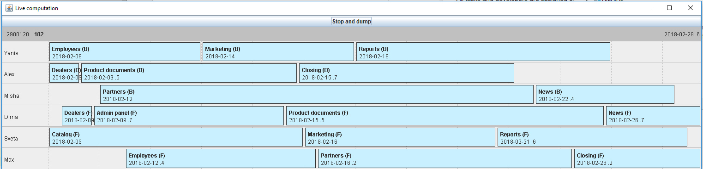

# Tiny Scheduling

Applying different approaches to optimize assigning of interdependent
tasks to developers with different skill-sets and efficiencies

## Model

### Skill-set

For the sake of simplicity, only two mutually exclusive skill-sets
are considered:

* Front-end
* Back-end

All tasks and developers are assigned one of these skill-sets.

### Developer

A [developer](src/inego/tinyscheduling/Developer.kt) is an executor of tasks, and has:
* Name
* Skill-set
* Efficiency (ratio to the Ideal developer)
* Leader — _optional_ reference to another developer overseeing this one.
Efficiency of the _leader_ will be lowered when she's working on
her own tasks at the time when people led by her are doing their tasks.
* Starting date — _optional_ date when the developer becomes available
to the project.

### Task

A task has:
* Name
* Type (skill-set)
* Cost (in ideal hours)
* Dependency — _optional_, a single task that has to be finished before
this task can start)
* Executor restiction — _optional_, a single exclusive developer who
can handle this task
* First flag — _optional_, to define a subset of tasks which have to
start before all other tasks

### Calendar

A calendar is an int-to-date two-way mapping support to render dates in
a plausible form (skipping weekends or holidays).

### Project

A project consists of a calendar, a set developers and tasks, and serves as an input to the optimizing algorithms.

## Goal

Given a project, successively assign tasks to developers in such a way
as to minimize the moment the last task is completed.

## Input

Currently, the input is hard-coded. See `inego/tinyscheduling/Sample.kt`.

## Approaches

### Genetic Algorithm

Solutions in this approach tolerate different violations of restrictions
imposed by the model, and these restrictions are penalized.

This approach allowed to retain the maximum number of model features,
but showed to be quite slow.

### Monte Carlo tree search

A run of the program with this approach represents a single step in
repeated local optimum search performed with the Monte Carlo tree search
algorithm.

A "move", or a node in the tree, is a modification of the parent solution
consisting of either changing a developer assigned to a certain task,
or changing its date.

Playouts are performed until a better solution is found, in which case
this solution becomes the root of the tree.

### Plain Branch-and-bound

This (and the next) approach perform search in a space of lighter
solutions, namely, there is no leader penalty.

The search is exhaustive in the tree of solutions, where the root
is an empty set of assignments and every node's children are defined
by corresponding sets of possible assignments of available tasks.

See the [Wikipedia article](https://en.wikipedia.org/wiki/Branch_and_bound).

This approach is the slowest, since the search space is too huge and
the BB heuristic can't cope with it well.

### MCTS / BB combination

As above, but the tree is explored with MCTS algorithm, applying
BB heuristics (which significantly simplifies and lightens the tree
by constantly chopping off branches known to contain suboptimal
solutions only.

This algorithm finds the optimum (or solutions very close to it) very
quickly.

## UI / Visualisation

Live computation in a Swing frame using a custom Gantt-like chart
written specifically for this project.

